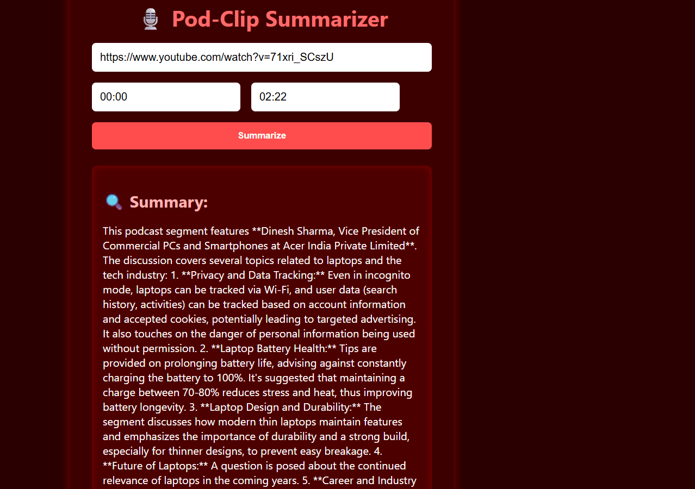

# 🎙️ POD-CLIP Frontend

A stylish and animated React-based frontend for the **Pod-Clip** application. This interface allows users to enter a YouTube link with a start and end timestamp to extract and summarize a podcast or video clip using FastAPI + Gemini on the backend.

---

## 📸 Demo

 
---

## 🚀 Features

- 🔗 Paste YouTube link with time range.
- 📼 Upload gets processed via FastAPI backend.
- 🤖 Gemini-based summary shown below the form.
- ⚡ Smooth animations with `framer-motion`.
- 🎨 Custom CSS.
- 🔧 Environment-based API configuration.

---

## 🛠️ Tech Stack

- **Frontend:** React (with plain CSS)
- **Animations:** Framer Motion
- **API Integration:** Fetch with JSON body
- **Environment Handling:** `.env` file with `REACT_APP_API_URL`

---

## 📁 Project Structure
```
pod-clip-frontend/
├── public/
│ └── index.html
├── src/
│ ├── App.jsx # Main component
│ ├── api.js # API call functions
│ ├── styles.css # Custom CSS styles
│ └── index.js # Entry point
├── .env # API base URL
├── .gitignore
├── package.json
└── README.md
```
## 🔧 Environment Setup

Create a `.env` file in the root:

```env
REACT_APP_API_URL=http://127.0.0.1:8000
```

## Download Backend and start it to running 


## Running Locally
```
# Clone the repo
git clone https://github.com/your-username/pod-clip-frontend.git
cd pod-clip-frontend

# Install dependencies
npm install

# Run the frontend
npm start
```
visit http://localhost:3000 in your browser


